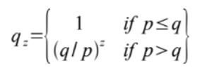
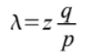
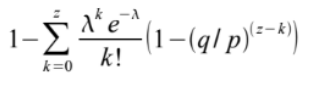
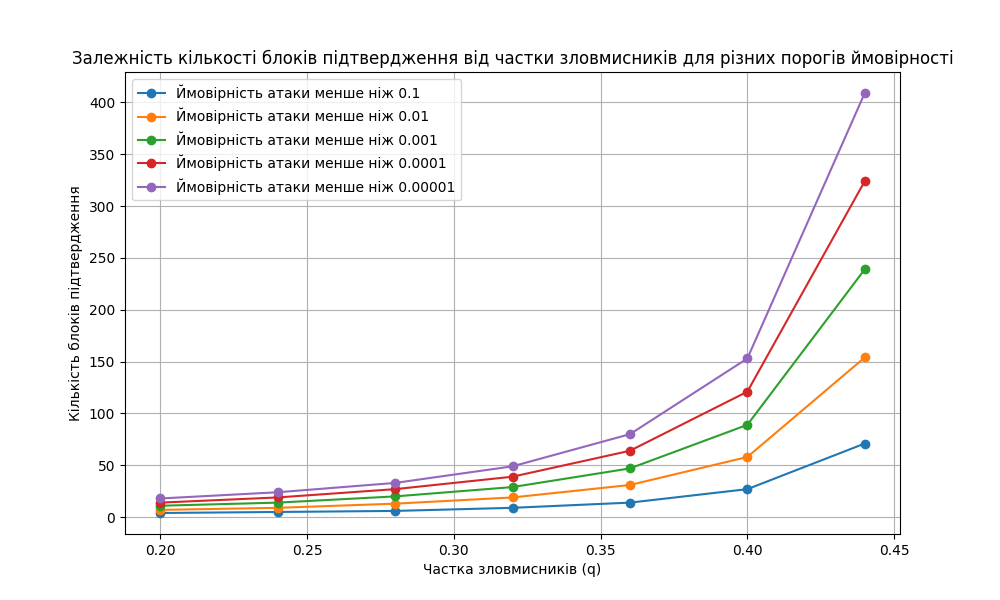
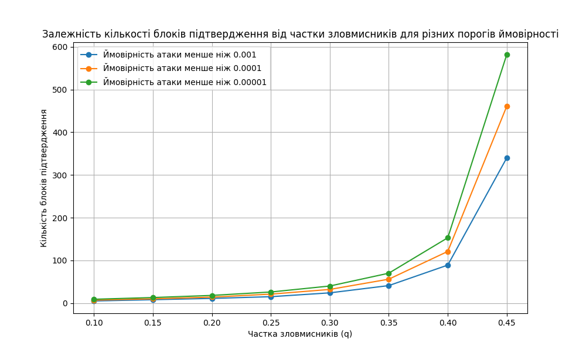

# BTCOP_l4

_Created for the course "Blockchain technologies and cryptocurrency operating platforms" V. N. Karazin Kharkiv National University_

Python 3.10.6 "Probability of success of a double-cost attack according to the Nakamoto model" using the matplotlib.pyplot library.

---

The calculation of the number of blocks for the Nakamoto model is enabled in a loop using a function:
attacker_success_probability(q, max, limit=1_000_000_000)
Where:

- `q` - The proportion of attackers (the probability that attackers will create the next block before honest miners)
- `max` - Maximum attack probability
- `limit` - The maximum number of calculation blocks

The program calculates values and creates a graph for the values entered through the command line arguments:

- `qStart` - Starting value of q, default is 0.1
- `qCount` - Number of values of q, by default 8
- `qStep` - Step of change of q, by default 0.05
- `maxStart` - Degree of the initial value max (0.001 is 3), by default 3
- `maxStop` - Degree of the final value max (0.00001 is 6), by default 6
- `limit` - The maximum number of computational blocks for each calculation, by default 1000000000

The result of the program is a table and a graph.

Nakamoto model (for Bitcoin) Parameters:

- 𝑝 is the probability that honest miners will create the next block before the attackers (i.e., faster);
- 𝑞 = 1 - 𝑝 - the probability that attackers will create the next block before honest miners (i.e., faster);
- 𝑞 is the probability that the attackers will ever catch up with 𝑧 (surpass) z blocks behind.



The potential progress of the attacker will be a Poisson distribution with an expected value:



The probability of success of a double-cost attack after z blocks of confirmation is:



# Examples

```python
> python DoubleSpendAttackNakamoto.py 0.2 7 0.04 1 6 1000
l4 "Probability of success of a double-cost attack according to the Nakamoto model" by Shkilnyi V. CS31
qStart: 0.2, qCount: 7, qStep: 0.04, maxStart: 1, maxStop: 6
q: [0.2, 0.24, 0.28, 0.32, 0.36, 0.4, 0.44]
max: [0.1, 0.01, 0.001, 0.0001, 1e-05]

q          p          0.1        0.01       0.001      0.0001     0.00001
0.2        0.8        4          7          11         14         18
0.24       0.76       5          9          14         19         24
0.28       0.72       6          13         20         27         33
0.32       0.68       9          19         29         39         49
0.36       0.64       14         31         47         64         80
0.4        0.6        27         58         89         121        153
0.44       0.56       71         154        239        324        409

> python DoubleSpendAttackNakamoto.py
l4 "Probability of success of a double-cost attack according to the Nakamoto model" by Shkilnyi V. CS31
qStart: 0.1, qCount: 8, qStep: 0.05, maxStart: 3, maxStop: 6
q: [0.1, 0.15, 0.2, 0.25, 0.3, 0.35, 0.4, 0.45]
max: [0.001, 0.0001, 1e-05]

q          p          0.001      0.0001     0.00001
0.1        0.9        5          7          9
0.15       0.85       8          10         13
0.2        0.8        11         14         18
0.25       0.75       15         21         26
0.3        0.7        24         32         40
0.35       0.65       41         56         70
0.4        0.6        89         121        153
0.45       0.55       340        461        582
```




